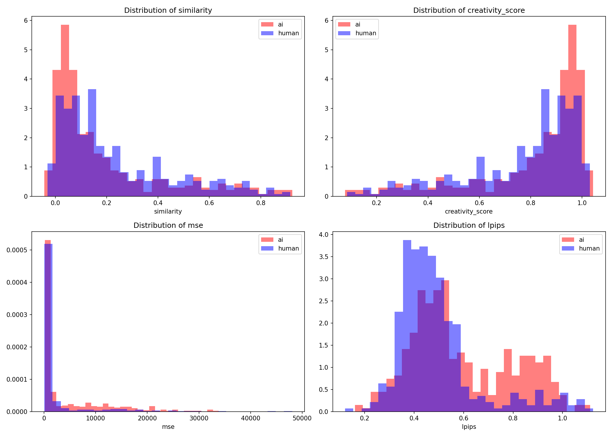
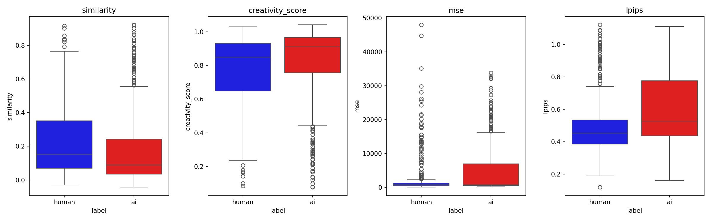
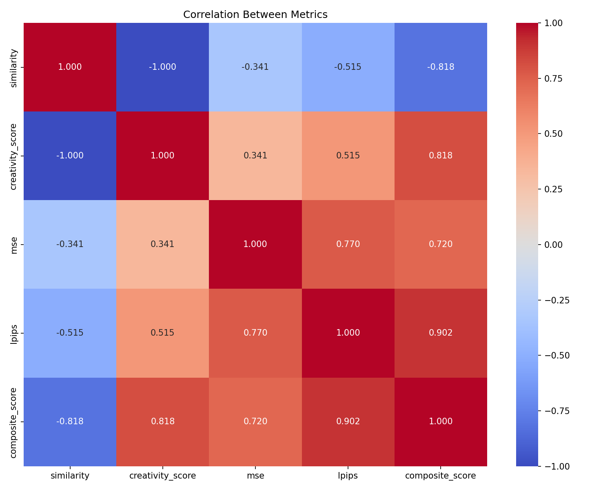
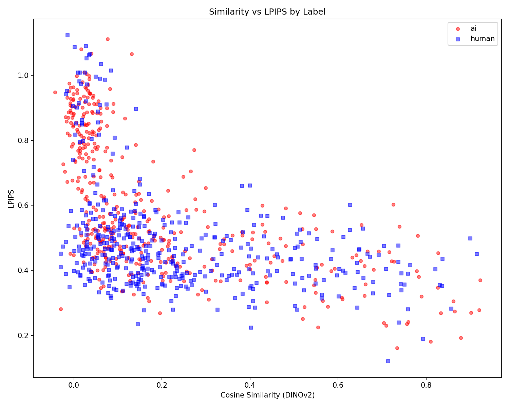
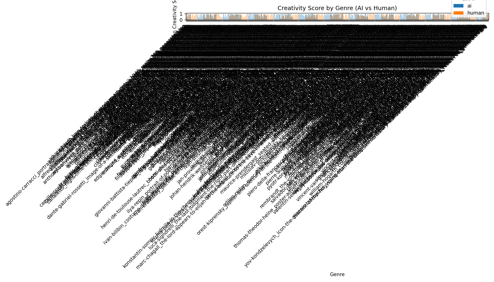

# Comprehensive Creativity Analysis Report

**Analysis Date**: 2025-12-18
**Total Samples**: 850 (AI: 425, Human: 425)

## Key Findings

### Creativity Score Comparison
- **AI Mean**: 0.8137
- **Human Mean**: 0.7692
- **Difference**: 0.0445

### Statistical Significance
- T-test: t=2.9383, p=0.003390
- Mann-Whitney U: p=0.000003

### Interpretation

> ⚠️ **Unexpected Result**: AI-generated images show **higher** reconstruction error (creativity score) than Human art.

This contradicts the initial hypothesis. Possible explanations:

1. **Training Data Bias**: SD 1.5 was trained extensively on WikiArt, enabling near-perfect reconstruction of human art.
2. **Generation Artifacts**: AI images may contain subtle artifacts that are difficult to reconstruct via DDIM inversion.
3. **Inversion Limitations**: DDIM inversion may not perfectly capture AI-generated latent distributions.

## Visualizations

## Recommendations

1. **Use a Different Base Model**: Try SD2.1 or SDXL to reduce WikiArt training bias.
2. **Use Real Out-of-Domain Human Art**: Use contemporary art not in WikiArt.
3. **Compare Different AI Generators**: Compare Midjourney, DALL-E, etc.
4. **Increase Sample Size**: Continue evaluation to full 3000+ samples for robustness.
