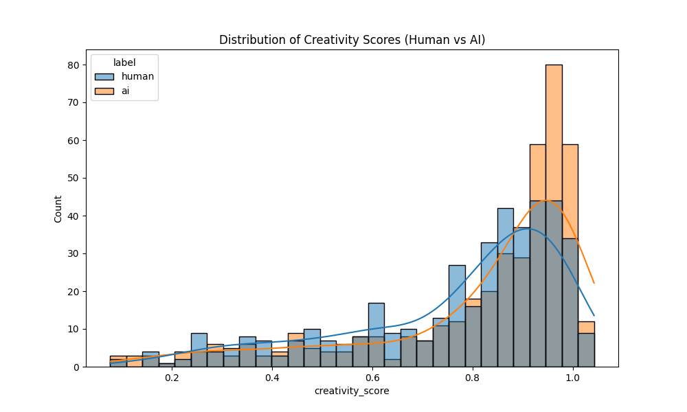
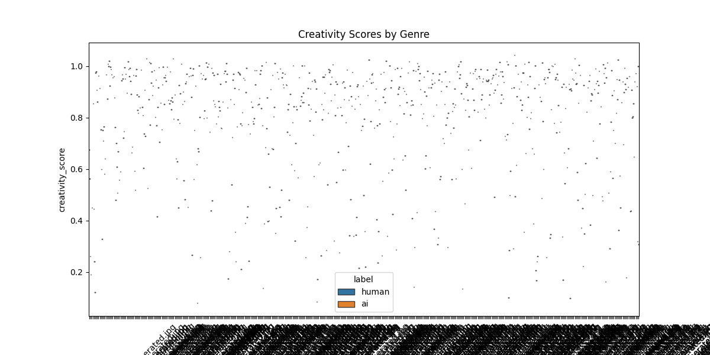

# Creativity Hypothesis Analysis Report

## Summary Statistics
| label   |   count |     mean |      std |       min |      25% |      50% |      75% |     max |
|:--------|--------:|---------:|---------:|----------:|---------:|---------:|---------:|--------:|
| ai      |     425 | 0.81374  | 0.22372  | 0.0773035 | 0.756756 | 0.911041 | 0.96659  | 1.04278 |
| human   |     425 | 0.769239 | 0.217797 | 0.0848778 | 0.647978 | 0.848622 | 0.930985 | 1.02991 |

**Statistical Test (T-test):** t=-2.94, p=0.0034
Result is statistically significant.

## visualizations

