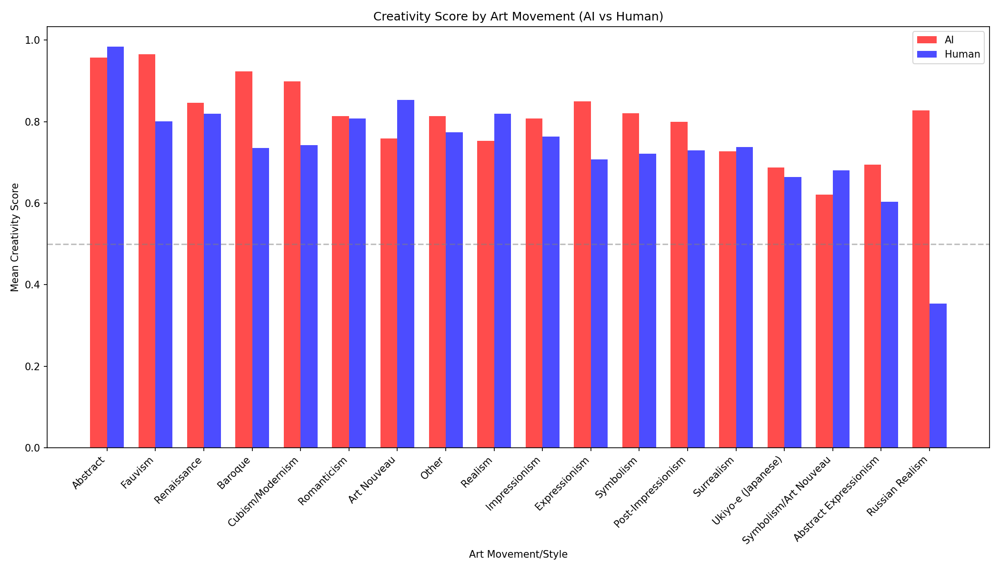
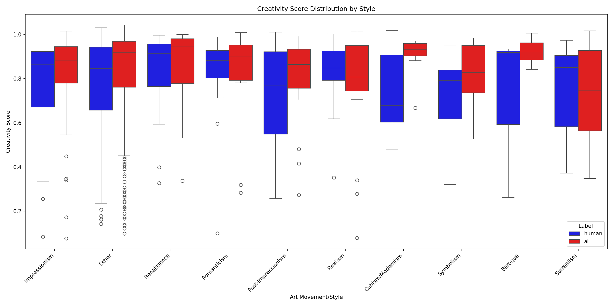
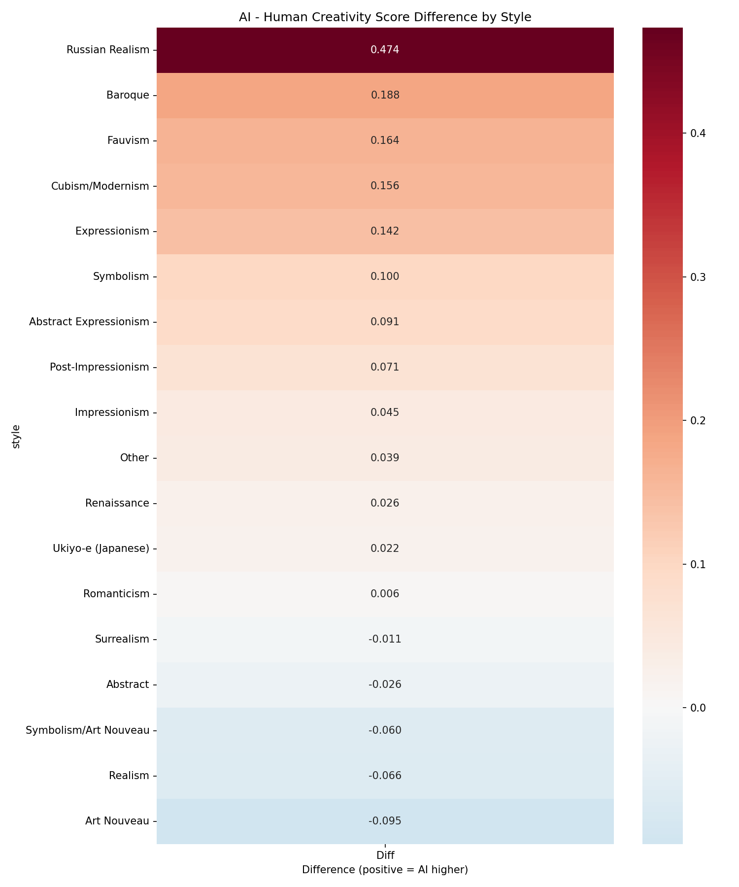
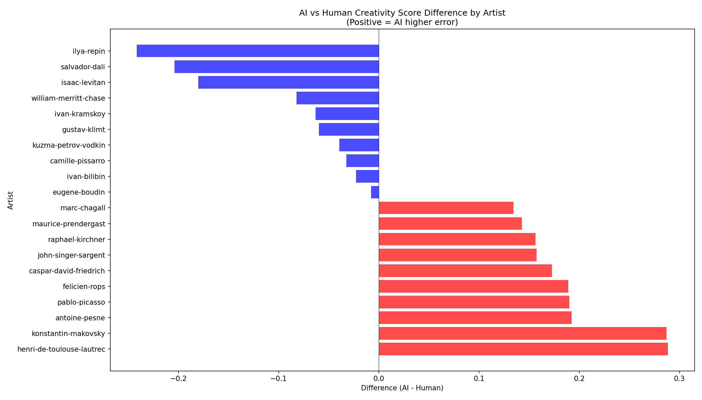

# Genre and Style Breakdown Analysis

**Analysis Date**: 2025-12-18
**Total Samples**: 850
**Unique Artists**: 254
**Art Movements**: 18

## Art Movement Summary

| Style | AI Mean | Human Mean | Diff | Samples | p-value |
|-------|---------|------------|------|---------|--------|
| Baroque | 0.924 | 0.736 | +0.188 | 7 | 0.1222 |
| Cubism/Modernism | 0.899 | 0.742 | +0.156 | 7 | 0.1034 |
| Symbolism | 0.821 | 0.721 | +0.100 | 12 | 0.1468 |
| Post-Impressionism | 0.800 | 0.729 | +0.071 | 21 | 0.2901 |
| Impressionism | 0.808 | 0.764 | +0.045 | 44 | 0.3588 |
| Other | 0.814 | 0.774 | +0.039 | 267 | 0.0424* |
| Renaissance | 0.846 | 0.820 | +0.026 | 16 | 0.7153 |
| Romanticism | 0.814 | 0.808 | +0.006 | 14 | 0.9488 |
| Surrealism | 0.727 | 0.738 | -0.011 | 7 | 0.9363 |
| Realism | 0.753 | 0.819 | -0.066 | 15 | 0.4528 |

## Key Observations

## Visualizations

